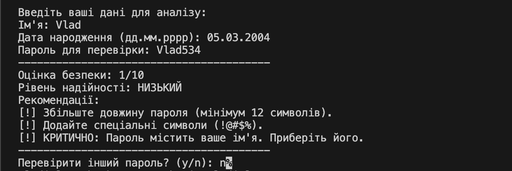
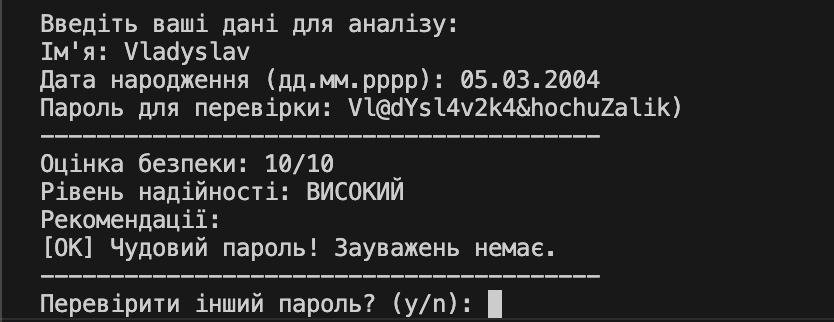

# Application_and_data_security_LR1

Консольна утиліта на мові C# для комплексного аналізу надійності паролів. Програма оцінює криптографічну стійкість пароля та перевіряє його на наявність персональних даних користувача, що є критичним фактором безпеки.

## 📋 Основні можливості

* **Структурний аналіз:** Перевірка довжини, наявності великих/малих літер, цифр та спеціальних символів (використання **LINQ**).
* **Детекція персональних даних:** Алгоритм виявляє використання імені або дати народження (включно з роком) у тілі пароля.
* **Regex-парсинг:** Використання регулярних виразів для точного виділення року народження з дати формату `дд.мм.рррр`.
* **Система оцінювання:** Розрахунок рейтингу безпеки від 1 до 10 із системою штрафів за вразливості.
* **Рекомендації:** Надання конкретних порад щодо покращення пароля.
* **Циклічний режим:** Можливість тестувати декілька паролів без перезапуску програми.

## 🛠 Технології
* **Мова:** C#
* **Платформа:** .NET (Core / 5 / 6 / 7 / 8)
* **Інструментарій:** System.Text.RegularExpressions, System.Linq

## 🚀 Як запустити

### Варіант 1: Через термінал (VS Code)
1. Переконайтеся, що у вас встановлено **.NET SDK**.
2. Відкрийте папку з проектом у терміналі.
3. Виконайте команду для запуску:
   "dotnet run"

### Варіант 2: Через Visual Studio
1. Відкрийте файл рішення (.sln) або файл проекту (.csproj).
2. Натисніть кнопку Start або клавішу F5.

## 📸 Результати роботи
## Нижче наведено приклади роботи програми з різними рівнями безпеки паролів.

1. Приклад слабкого пароля (з використанням персональних даних)
Тут продемонстровано роботу алгоритму виявлення року народження.

2. Приклад надійного пароля
Демонстрація високої оцінки при дотриманні всіх вимог.

